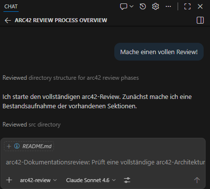
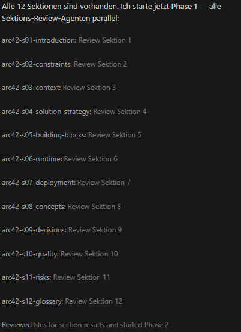
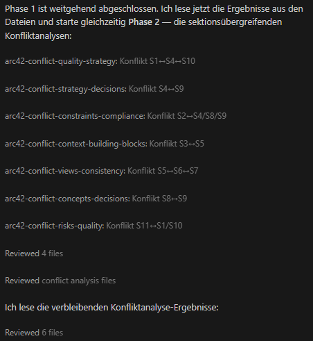
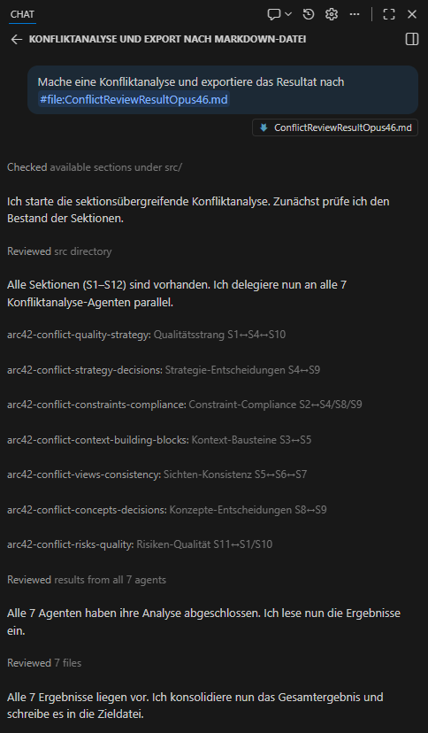

# Arc42 Review Agents

Ein agentenbasiertes Review-System für [arc42](https://docs.arc42.org/home/)-Architekturdokumentation in VS Code. Das System prüft arc42-Dokumente formal und inhaltlich gegen die arc42-Anforderungen — automatisiert, strukturiert und sektionsübergreifend.

Die Resultate können als Basis für eine (agentische) Überarbeitung der Dokumentation dienen.

## Überblick

Das Agentensystem besteht aus **22 spezialisierten Agenten** in vier Kategorien:

- **3 Orchestratoren** — steuern den Review-Ablauf
- **12 Sektions-Agenten** — prüfen jeweils eine arc42-Sektion
- **7 Konflikt-Agenten** — analysieren sektionsübergreifende Widersprüche

Gemeinsame Formate (Review-Modi, Befund-Templates, allgemeine Regeln) sind im **Skill [`arc42-review-format`](.github/skills/arc42-review-format/SKILL.md)** zentral definiert und werden von allen Agenten referenziert.

### Review-Modi

| Modus | Orchestrator | Beschreibung |
|---|---|---|
| **Vollständiges Review** | `arc42-review` | Prüft alle Sektionen und führt Konfliktanalyse durch |
| **Branch-Review** | `arc42-branch-review` | Reviewt nur die geänderten Dateien eines Git-Branches |
| **Nur Konfliktanalyse** | `arc42-conflict-review` | Führt nur die sektionsübergreifende Konsistenzprüfung durch |

## Voraussetzungen

- [Github Copilot CLI](https://github.com/features/copilot/cli) oder [VS Code](https://code.visualstudio.com/) mit [GitHub Copilot](https://github.com/features/copilot)
- Die Agent-Dateien unter `agents/` werden von VS Code/Copilot nicht automatisch erkannt. Es ist ein symlink von `agents`nach `.github/agents` erforderlich.

## Verwendung

Wähle den jewiligen Agenten in GitHub Copilot aus. Verwende keine Delegation über `@arc42-review` da Copilot aktuell nur eine ebene der Delegation unterstützt, die Subagenten würden sonst sequentiell im gleichen Context ausgeführt.

### Vollständiges Review starten

Rufe in Copilot den Agenten `arc42-review` auf (z. B. über den Copilot-Chat). Er:

1. Identifiziert alle vorhandenen Sektionen unter `src/`
2. Delegiert an die 12 Sektions-Agenten
3. Startet die sektionsübergreifende Konfliktanalyse
4. Erstellt einen konsolidierten Prüfbericht mit Ampel-Bewertung

Ein Reviewesultat befindet sich hier [FullReviewResultOpus46.md](FullReviewResultOpus46.md). Je nach verwendetem Modell unterscheiden sich die Resultate leicht.

Identifiziert alle vorhandenen Sektionen unter `src/`



Delegiert an die 12 Sektions-Agenten:



Starten der sektionsübergreifenden Konfliktanalyse 



### Branch-Review starten

Rufe den Agenten `arc42-branch-review` auf. Er:

1. Ermittelt geänderte Dateien via `git diff`
2. Identifiziert betroffene arc42-Sektionen
3. Delegiert nur an die zuständigen Sektions-Agenten im **Delta-Modus**
4. Löst relevante Konfliktanalysen basierend auf den geänderten Sektionen aus
5. Erstellt einen fokussierten Änderungs-Review-Bericht

### Nur Konfliktanalyse starten

Rufe den Agenten `arc42-conflict-review` auf. Er führt alle 7 Konfliktdimensionen durch und liefert eine Konfliktkarte der Dokumentation.

Ein Reviewresultat befindet sich hier [ConflictReviewResultOpus46.md](ConflictReviewResultOpus46.md)



## Agenten im Detail

### Orchestratoren

| Agent | Beschreibung | Link |
|---|---|---|
| `arc42-review` | Hauptorchestrator: Vollständiges Review aller Sektionen + Konfliktanalyse | [arc42-review](agents/arc42-review.agent.md) |
| `arc42-branch-review` | Branch-Review: Ermittelt geänderte Dateien per Git-Diff, delegiert gezielt im Delta-Modus | [arc42-branch-review](agents/arc42-branch-review.agent.md) |
| `arc42-conflict-review` | Konfliktanalyse-Orchestrator: Koordiniert alle 7 Konfliktdimensionen | [arc42-conflict-review](agents/arc42-conflict-review.agent.md) |

### Sektions-Agenten

Jeder Sektions-Agent prüft eine arc42-Sektion gegen die offiziellen Kriterien. Alle unterstützen den **Vollständig-Modus** (prüft alles) und den **Delta-Modus** (prüft nur Änderungen).

| Agent | Sektion | Prüfgegenstand | Link |
| --- | --- | --- | --- |
| `arc42-s01-introduction` | 1 — Einführung und Ziele | Anforderungsüberblick, Qualitätsziele, Stakeholder | [arc42-s01-introduction](agents/arc42-s01-introduction.agent.md) |
| `arc42-s02-constraints` | 2 — Randbedingungen | Technische, organisatorische und politische Constraints, Konventionen | [arc42-s02-constraints](agents/arc42-s02-constraints.agent.md) |
| `arc42-s03-context` | 3 — Kontextabgrenzung | Fachlicher Kontext, technischer Kontext, externe Schnittstellen | [arc42-s03-context](agents/arc42-s03-context.agent.md) |
| `arc42-s04-solution-strategy` | 4 — Lösungsstrategie | Grundlegende Entscheidungen und Lösungsansätze | [arc42-s04-solution-strategy](agents/arc42-s04-solution-strategy.agent.md) |
| `arc42-s05-building-blocks` | 5 — Bausteinsicht | Statische Zerlegung, Blackbox/Whitebox, Hierarchieebenen | [arc42-s05-building-blocks](agents/arc42-s05-building-blocks.agent.md) |
| `arc42-s06-runtime` | 6 — Laufzeitsicht | Laufzeitszenarien, Interaktionen zwischen Bausteinen | [arc42-s06-runtime](agents/arc42-s06-runtime.agent.md) |
| `arc42-s07-deployment` | 7 — Verteilungssicht | Technische Infrastruktur, Deployment, Software-Hardware-Mapping | [arc42-s07-deployment](agents/arc42-s07-deployment.agent.md) |
| `arc42-s08-concepts` | 8 — Querschnittliche Konzepte | Übergreifende Lösungsansätze, Muster, Domänenmodelle | [arc42-s08-concepts](agents/arc42-s08-concepts.agent.md) |
| `arc42-s09-decisions` | 9 — Architekturentscheidungen | ADRs, Entscheidungsdokumentation (Nygard-Format) | [arc42-s09-decisions](agents/arc42-s09-decisions.agent.md) |
| `arc42-s10-quality` | 10 — Qualitätsanforderungen | Qualitätsbaum, Qualitätsszenarien | [arc42-s10-quality](agents/arc42-s10-quality.agent.md) |
| `arc42-s11-risks` | 11 — Risiken und technische Schulden | Risikoliste, technische Schulden, Maßnahmen | [arc42-s11-risks](agents/arc42-s11-risks.agent.md) |
| `arc42-s12-glossary` | 12 — Glossar | Begriffsdefinitionen, Terminologie-Konsistenz | [arc42-s12-glossary](agents/arc42-s12-glossary.agent.md) |

### Konflikt-Agenten

Die Konflikt-Agenten prüfen die **sektionsübergreifende Konsistenz** und decken Widersprüche zwischen zusammenhängenden Sektionen auf. Alle unterstützen Vollständig- und Delta-Modus.

| Agent | Dimension | Sektionen | Prüfgegenstand | Link |
|---|---|---|---|---|
| `arc42-conflict-quality-strategy` | Qualitätsstrang | S1 ↔ S4 ↔ S10 | Konsistenz von Qualitätszielen, Strategie und Qualitätsszenarien | [arc42-conflict-quality-strategy](agents/arc42-conflict-quality-strategy.agent.md) |
| `arc42-conflict-strategy-decisions` | Strategie ↔ Entscheidungen | S4 ↔ S9 | Alignment und Redundanzen zwischen Strategie und ADRs | [arc42-conflict-strategy-decisions](agents/arc42-conflict-strategy-decisions.agent.md) |
| `arc42-conflict-constraints-compliance` | Constraint-Compliance | S2 ↔ S4/S8/S9 | Verletzung von Randbedingungen durch Strategie, Konzepte oder Entscheidungen | [arc42-conflict-constraints-compliance](agents/arc42-conflict-constraints-compliance.agent.md) |
| `arc42-conflict-context-building-blocks` | Kontext ↔ Bausteine | S3 ↔ S5 | Schnittstellen-Konsistenz zwischen Kontextdiagramm und Bausteinsicht | [arc42-conflict-context-building-blocks](agents/arc42-conflict-context-building-blocks.agent.md) |
| `arc42-conflict-views-consistency` | Sichten-Konsistenz | S5 ↔ S6 ↔ S7 | Baustein-Konsistenz über Baustein-, Laufzeit- und Verteilungssicht | [arc42-conflict-views-consistency](agents/arc42-conflict-views-consistency.agent.md) |
| `arc42-conflict-concepts-decisions` | Konzepte ↔ Entscheidungen | S8 ↔ S9 | Trennung und Konsistenz zwischen Konzepten und Entscheidungen | [arc42-conflict-concepts-decisions](agents/arc42-conflict-concepts-decisions.agent.md) |
| `arc42-conflict-risks-quality` | Risiken ↔ Qualität | S11 ↔ S1/S10 | Ob Risiken Qualitätsziele bedrohen und Gegenmaßnahmen existieren | [arc42-conflict-risks-quality](agents/arc42-conflict-risks-quality.agent.md) |

## Delegationsfluss

```
Vollständiges Review:
  arc42-review
    ├── arc42-s01-introduction  (Vollständig-Modus)
    ├── arc42-s02-constraints    ...
    ├── ...
    ├── arc42-s12-glossary
    |   arc42-conflict-review
    ├── arc42-conflict-quality-strategy
    ├── arc42-conflict-strategy-decisions
    ├── arc42-conflict-constraints-compliance
    ├── arc42-conflict-context-building-blocks
    ├── arc42-conflict-views-consistency
    ├── arc42-conflict-concepts-decisions
    └── arc42-conflict-risks-quality

Branch-Review:
  arc42-branch-review
    ├── git diff → betroffene Sektionen ermitteln
    ├── arc42-s04-solution-strategy  (Delta-Modus, nur Änderungen)
    ├── arc42-s09-decisions           (Delta-Modus, nur Änderungen)
    ├── ...nur betroffene Agenten...
    ├── arc42-conflict-strategy-decisions  (Delta-Modus)
    └── ...nur relevante Konflikt-Agenten...
```

## Beispiel-Dokumentation (`src/`)

Das Verzeichnis `src/` enthält eine vollständige arc42-Architekturdokumentation des Schach-Programms **DokChess** als Referenzbeispiel. Die Dokumentation stammt von Stefan Zörner und ist unter [dokchess.de](https://www.dokchess.de/) im Detail beschrieben.

Die Dokumentation von Stefan wurde automatisch heruntergeladen und in Markdown überführt. Von mir wurden die dokumentierten Entscheidungen in das ADR Format von Nygard überführt.

Die Struktur folgt dem [arc42-Template](https://docs.arc42.org/home/) mit 12 Sektionen:

```
src/
├── 00-Ueberblick/              Überblick
├── 01-Einfuehrung-und-Ziele/   Aufgabenstellung, Qualitätsziele, Stakeholder
├── 02-Randbedingungen/          Technisch, Organisatorisch, Konventionen
├── 03-Kontextabgrenzung/        Fachlicher und technischer Kontext
├── 04-Loesungsstrategie/        Aufbau, Spielstrategie, Anbindung
├── 05-Bausteinsicht/            Ebene 1 & 2, XBoard, Engine, Spielregeln
├── 06-Laufzeitsicht/            Zugermittlung
├── 07-Verteilungssicht/         Infrastruktur Windows
├── 08-Konzepte/                 Domänenmodell, Validierung, Logging, Testbarkeit
├── 09-Entscheidungen/           Anbindung, Stellungsobjekte
├── 10-Qualitaetsanforderungen/  Qualitätsbaum, Qualitätsszenarien
├── 11-Risiken/                  Frontend, Aufwand, Spielstärke
├── 12-Glossar/                  Begriffe
└── images/                      Diagramme und Abbildungen
```

> Die Beispiel-Dokumentation steht unter der Lizenz [CC BY-NC-SA 4.0](https://creativecommons.org/licenses/by-nc-sa/4.0/) von Stefan Zörner / [dokchess.de](https://www.dokchess.de/). Siehe [src/LICENSE.md](src/LICENSE.md).

## Branches zum Testen

Das Repository enthält Branches, in denen gezielt Änderungen an der arc42-Dokumentation vorgenommen wurden. Diese dienen dazu, die **Branch-Review-Funktionalität** (`arc42-branch-review`) zu testen:

1. Wechsle zu einem Test-Branch: `git checkout <branch-name>`
2. Starte den Branch-Review: `arc42-branch-review`
3. Der Agent erkennt automatisch die Änderungen gegenüber `main` und reviewt nur die betroffenen Dateien

So lässt sich das Delta-Review in der Praxis ausprobieren und überprüfen, ob die Agenten korrekt im Delta-Modus arbeiten.

## Lizenz

Dieses Repository enthält zwei unabhängige Komponenten mit unterschiedlichen Lizenzen:

| Komponente | Pfad | Lizenz |
|---|---|---|
| Arc42 Review Agents | `agents/` | [MIT License](LICENSE) |
| DokChess-Beispieldokumentation | `src/` | [CC BY-NC-SA 4.0](src/LICENSE.md) von Stefan Zörner / [dokchess.de](https://www.dokchess.de/) |

Die Agenten-Definitionen (`agents/`) sind eigenständige Werkzeuge und kein abgeleitetes Werk der Beispieldokumentation. Sie stehen unter der MIT-Lizenz und können frei verwendet, verändert und weitergegeben werden.

## Projektstruktur

```
Arc42Agents/
├── README.md               ← Diese Datei
├── LICENSE                  MIT License (gilt für agents/)
├── agents/                  22 Agent-Definitionen (.agent.md)
│   ├── arc42-review.agent.md
│   ├── arc42-branch-review.agent.md
│   ├── arc42-conflict-review.agent.md
│   ├── arc42-s01-introduction.agent.md
│   ├── ...
│   ├── arc42-s12-glossary.agent.md
│   ├── arc42-conflict-quality-strategy.agent.md
│   ├── ...
│   └── arc42-conflict-risks-quality.agent.md
└── src/                     Beispiel-Dokumentation (DokChess, CC BY-NC-SA 4.0)
    ├── LICENSE.md           CC BY-NC-SA 4.0 Lizenz
    ├── 01-Einfuehrung-und-Ziele/
    ├── ...
    ├── 12-Glossar/
    └── images/
```

## Weiterführende Links

- [arc42 — Dokumentation für Softwarearchitektur](https://docs.arc42.org/home/)
- [DokChess — Die Beispiel-Dokumentation](https://www.dokchess.de/)
- [arc42-Template auf GitHub](https://github.com/arc42/arc42-template)
