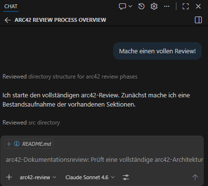
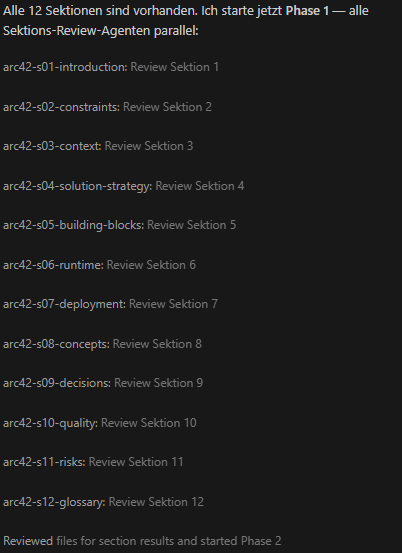
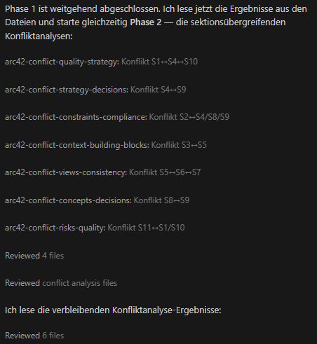
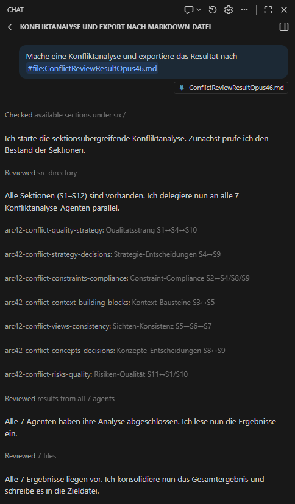

# arc42agentic

Ein agentenbasiertes System für [arc42](https://docs.arc42.org/home/)-Architekturdokumentation, das in verschiedenen Tools/IDEs genutzt werden kann (z. B. via APM oder in VS Code/GitHub Copilot) — zum **Reviewen** und **Schreiben**. Das System prüft arc42-Dokumente formal und inhaltlich gegen die arc42-Anforderungen und unterstützt beim Erstellen neuer Dokumentation — automatisiert, strukturiert und sektionsübergreifend.

## Überblick

Das Agentensystem besteht aus **24 spezialisierten Agenten** in fünf Kategorien:

- **3 Review-Orchestratoren** — steuern den Review-Ablauf
- **12 Sektions-Review-Agenten** — prüfen jeweils eine arc42-Sektion
- **7 Konflikt-Agenten** — analysieren sektionsübergreifende Widersprüche
- **2 Write-Agenten** — erstellen arc42-Dokumentation interaktiv oder aus Code

Vier Skills stellen gemeinsam genutzte Querschnittsfunktionalität bereit:

- **[`arc42-review-format`](.agents/skills/arc42-review-format/SKILL.md)** — Review-Modi, Befund-Templates und allgemeine Regeln, die von allen Review-Agenten referenziert werden.
- **[`arc42-orchestrator-format`](.agents/skills/arc42-orchestrator-format/SKILL.md)** — Gemeinsames Ausgabeformat für die drei Orchestrator-Agenten: Ampellogik, Übersichtstabellen, Konfliktkarte und konsolidierte Berichts-Templates.
- **[`arc42-doc-layout`](.agents/skills/arc42-doc-layout/SKILL.md)** — Struktur-Erkennung für verschiedene arc42-Dokumentationslayouts (Multi-Folder, Flat-Files, Single-File) und Delegations-Protokoll für Orchestratoren.
- **[`arc42-knowledge-graph`](.agents/skills/arc42-knowledge-graph/SKILL.md)** — Wandelt eine arc42-Dokumentation in einen Wissensgraphen (GraphML) um, den die Review-Agenten im Graph-Modus statt der rohen Dateien analysieren. Enthält Schema, Aufbau- und Validierungsskript (`scripts/`).

13 Skills stelllen Funktionalität für des Schreiben von Dokumentation bereit:

- **[`arc42-write-doc-layout`](.agents/skills/arc42-write-doc-layout/SKILL.md)** — Verzeichnisstruktur und Dateikonventionen für das Schreiben von arc42-Dokumentationen.
- **`arc42-write-s01` bis `arc42-write-s12`** — 12 sektionsspezifische Write-Skills mit Anleitungen, Fragestellungen und Templates für jede arc42-Sektion.

### Review-Modi

| Modus | Orchestrator | Beschreibung |
|---|---|---|
| **Vollständiges Review** | `arc42-review` | Prüft alle Sektionen und führt Konfliktanalyse durch |
| **Branch-Review** | `arc42-review-branch` | Reviewt nur die geänderten Dateien eines Git-Branches |
| **Nur Konfliktanalyse** | `arc42-review-conflict` | Führt nur die sektionsübergreifende Konsistenzprüfung durch |

### Analyse-Modi: Graph oder Datei

Jeder Review läuft wahlweise in einem von zwei Analyse-Modi. Die Modi sind unabhängig vom Review-Modus oben und gelten für alle Orchestratoren und Agenten.

| Analyse-Modus | Arbeitsgrundlage | Geeignet für |
|---|---|---|
| **Datei-Modus** | Die rohen Markdown-Dateien der Dokumentation, wie im ursprünglichen Ablauf | Einmalige oder kleine Reviews, ständig ändernde Dokumentation, keine Python-Umgebung |
| **Graph-Modus** | Ein Wissensgraph (GraphML) mit Entitäten (Qualitätsziele, Bausteine, ADRs, Risiken …) und typisierten Beziehungen (`addresses`, `concretizes`, `threatens` …), jeweils mit Quelldatei, Anker und Evidenz | Wiederholte Reviews, große Dokumentationen, sektionsübergreifende Konfliktanalyse |

Im Graph-Modus liefert der Graph strukturierte Fakten und die Zuordnungen zwischen Sektionen. Die inhaltliche Bewertung bleibt bei den Agenten, und jeder Befund zitiert weiterhin die Quelle. Anleitung: [Graph- oder Datei-Modus verwenden](#graph--oder-datei-modus-verwenden).

## Unterstützte Dokumentationsstrukturen

Das System erkennt automatisch drei verschiedene Layouts einer arc42-Dokumentation — gesteuert durch den Skill [`arc42-doc-layout`](.agents/skills/arc42-doc-layout/SKILL.md):

| Typ | Erkennungsmerkmal | Typisches Beispiel |
|---|---|---|
| **Multi-Folder** | Unterordner mit nummerierten Namen | `01-Einfuehrung-und-Ziele/`, `02-Randbedingungen/` |
| **Flat-Files** | Nur `.md`-Dateien im Verzeichnis, nummeriert oder mit Schlüsselwörtern | `chap-01-Anforderungen.md`, `chap-02-Randbedingungen.md` |
| **Single-File** | Eine (oder wenige) `.md`-Datei(en) mit allen Kapiteln als `##`-Überschriften | `architecture.md`, `biking2-architecture.md` |

Der Orchestrator erkennt den Typ automatisch, erstellt ein Sektion-zu-Datei-Mapping und übergibt jedem Sektions-Agenten die zugehörigen Dateipfade oder (bei Single-File) den extrahierten Inline-Content. Kein Sektions-Agent muss das Dokumentationslayout selbst kennen — das übernimmt der Skill.

## Installation

### Option A — APM (empfohlen, IDE-unabhängig)

Installiere die Pakete aus [`matthiasnissen/arc42agentic-packages`](https://github.com/matthiasnissen/arc42agentic-packages):

```bash
apm install matthiasnissen/arc42agentic-packages/arc42agenticreview
apm install matthiasnissen/arc42agentic-packages/arc42agenticwrite
```

APM funktioniert in Terminal, Zed, Cursor, VS Code und anderen APM-kompatiblen Tools. Einstieg: [APM Quick Start](https://microsoft.github.io/apm/getting-started/quick-start/).

### Option B — VS Code (manuell via Symlink)

Voraussetzung: [VS Code](https://code.visualstudio.com/) mit [GitHub Copilot](https://github.com/features/copilot).

Die Agent-Dateien unter `.agents/` werden von VS Code/Copilot nicht automatisch erkannt. In diesem Repository sind die Agenten daher bereits zusätzlich unter `.github/agents/` enthalten.

Falls du nur `.agents/` in ein anderes Repository übernimmst, kannst du `.agents/` nach `.github/agents/` verlinken (macOS/Linux, aus dem Repo-Root):

    mkdir -p .github
    ln -s .agents .github/agents

## Verwendung

Wähle den jewiligen Agenten in GitHub Copilot aus. Verwende keine Delegation über `@arc42-review` da Copilot aktuell nur eine ebene der Delegation unterstützt, die Subagenten würden sonst sequentiell im gleichen Context ausgeführt.

### Graph- oder Datei-Modus verwenden

**Modus wählen.** Nenne den Modus im Prompt, zum Beispiel:

- Graph-Modus: „Führe ein vollständiges Review im Graph-Modus durch“, „mit Graph“, „graphbasiert“
- Datei-Modus: „Führe ein vollständiges Review im Datei-Modus durch“, „ohne Graph“, „klassisch“

Ist der Modus nicht eindeutig, fragt der Orchestrator nach. Er teilt den gewählten Modus allen Sektions- und Konflikt-Agenten mit. Ruft man einen Sektions- oder Konflikt-Agenten direkt auf, fragt auch dieser nach dem Modus.

**Was im Graph-Modus passiert.**

1. Der Orchestrator sucht den Graphen unter `<Repository-Root>/.arc42-graph/<doku-ordner>.graphml` (Beispiel: `.arc42-graph/arc-doc.graphml`) mit `<doku-ordner>.manifest.json` und `<doku-ordner>.extraction.json`.
2. Er prüft die Aktualität über die SHA-256-Hashes im Manifest. Ist der Graph aktuell, wird er ohne Neuaufbau wiederverwendet.
3. Fehlt der Graph oder ist er veraltet, wird er neu aufgebaut: Der Agent extrahiert Entitäten und Beziehungen in eine JSON-Datei, und `scripts/build_graph.py` erzeugt daraus GraphML und Manifest, ergänzt Communities, validiert das Ergebnis und ersetzt alte Dateien nur bei Erfolg.
4. Die Sektions-Agenten filtern ihre Sektion über die Community (`c-s01` … `c-s12`). Die Konflikt-Agenten arbeiten mit ihrer Konfliktdimension (`c-qs`, `c-sd`, `c-cc`, `c-cb`, `c-vc`, `c-ke`, `c-rq`) und lesen Zuordnungen aus den Kanten. Kanten mit `evidence=inferred` gelten nur mit Vorbehalt, im Zweifel wird die Quelle nachgelesen.

Einen Neuaufbau erzwingst du mit „Graph neu bauen“ oder „ignoriere den Cache“ im Prompt.

**Voraussetzung.** Der Aufbau braucht Python 3 (nur Standardbibliothek) und eine Terminalausführung. Ohne beides schreibt der Agent GraphML und Manifest direkt gemäß Schema und weist darauf hin, dass die Validierung nicht gelaufen ist. Der Datei-Modus benötigt keines von beidem.

**Graph manuell bauen und prüfen.** Das ist nützlich, um einen Graphen unabhängig von einem Review zu erzeugen oder zu kontrollieren. Bei einer APM-Installation liegen die Skills unter `.github/skills/` statt `.agents/skills/`:

```bash
# Extraktion (JSON) in einen Graphen überführen; --doc darf ein Ordner oder eine einzelne Datei sein
python3 .agents/skills/arc42-knowledge-graph/scripts/build_graph.py extraktion.json --doc arc-doc --out-dir .arc42-graph

# Vorhandenen Graphen gegen Schema, Quelldateien und Manifest prüfen (Hinweis graph-duenn bei auffällig dünnen Graphen)
python3 .agents/skills/arc42-knowledge-graph/scripts/validate_graph.py .arc42-graph/arc-doc.graphml --doc arc-doc --manifest .arc42-graph/arc-doc.manifest.json
```

Beispielgraphen mit den zugehörigen Extraktionen zu DokChess liegen in [.arc42-graph_demo_results/](.arc42-graph_demo_results/).

**Branch-Review im Graph-Modus.** `arc42-review-branch` baut den Graphen nicht komplett neu. Er entfernt die Knoten der geänderten Dateien aus der Extraktionsdatei, extrahiert diese Dateien neu und baut mit `build_graph.py --changed <datei>:added|modified` neu. Dadurch tragen die betroffenen Knoten und Kanten `changed=true`, und die Agenten prüfen nur diese und ihre Nachbarschaft.

### Vollständiges Review starten

Rufe in Copilot den Agenten `arc42-review` auf (z. B. über den Copilot-Chat) und nenne den Analyse-Modus (siehe oben). Er:

1. Identifiziert alle vorhandenen Sektionen unter `arc-doc/` (im Graph-Modus: stellt zusätzlich den Wissensgraphen bereit)
2. Delegiert an die 12 Sektions-Agenten
3. Startet die sektionsübergreifende Konfliktanalyse
4. Erstellt einen konsolidierten Prüfbericht mit Ampel-Bewertung

Reviewresultate zu `arc-doc/` liegen für beide Analyse-Modi und drei Modelle vor:

| Modell | Graph-Modus | Datei-Modus |
|---|---|---|
| Opus 5.5 | [FullReviewResultGraphOpus55.md](FullReviewResultGraphOpus55.md) | [FullReviewResultFilesOpus55.md](FullReviewResultFilesOpus55.md) |
| GPT 6.1 Sol | [FullReviewResultGraphGPT61Sol.md](FullReviewResultGraphGPT61Sol.md) | [FullReviewResultFilesGPT61Sol.md](FullReviewResultFilesGPT61Sol.md) |
| Sonnet 5.5 | [FullReviewResultGraphSonnet55.md](FullReviewResultGraphSonnet55.md) | [FullReviewResultFilesSonnet55.md](FullReviewResultFilesSonnet55.md) |

Je nach Modell und Modus unterscheiden sich die Resultate. Eine Bewertung der Reviews steht in [BewertungReviewResults.md](BewertungReviewResults.md), eine Bewertung der zugehörigen Graphen in [Bewertunggraphen.md](Bewertunggraphen.md).

Identifiziert alle vorhandenen Sektionen unter `arc-doc/`



Delegiert an die 12 Sektions-Agenten:



Starten der sektionsübergreifenden Konfliktanalyse 



### Branch-Review starten

Rufe den Agenten `arc42-review-branch` auf. Er:

1. Ermittelt geänderte Dateien via `git diff`
2. Identifiziert betroffene arc42-Sektionen (im Graph-Modus aktualisiert er zusätzlich den Wissensgraphen inkrementell für die geänderten Dateien)
3. Delegiert nur an die zuständigen Sektions-Agenten im **Delta-Modus**
4. Löst relevante Konfliktanalysen basierend auf den geänderten Sektionen aus
5. Erstellt einen fokussierten Änderungs-Review-Bericht

Ein Reviewresultat des Branches Konflikt/ADR befindet sich hier: [BranchReviewConflicADROpus46.md](BranchReviewConflicADROpus46.md)

### Nur Konfliktanalyse starten

Rufe den Agenten `arc42-review-conflict` auf. Er führt alle 7 Konfliktdimensionen durch und liefert eine Konfliktkarte der Dokumentation.

Ein Reviewresultat befindet sich hier: [ConflictReviewResultOpus46.md](ConflictReviewResultOpus46.md)



## Dokumentation schreiben

Neben dem Review bietet das System zwei Agenten zum **Erstellen** von arc42-Dokumentation:

### Interaktiv dokumentieren

Rufe den Agenten `arc42-write` auf. Er führt dich systematisch durch alle 12 arc42-Sektionen:

1. Klärt Zielpfad und prüft auf bestehende Dokumentation
2. Sammelt pro Sektion gezielt Informationen über Rückfragen
3. Erstellt strukturierte Markdown-Dateien im arc42-Format
4. Führt abschließend eine Konsistenzprüfung über alle Sektionen durch

Der Agent lädt für jede Sektion den passenden Write-Skill (`arc42-write-s01` bis `arc42-write-s12`), der sektionsspezifische Fragen, Templates und Qualitätskriterien enthält.

### Aus Quellcode generieren

Rufe den Agenten `arc42-write-from-code` auf. Er analysiert eine bestehende Codebase und leitet daraus eine arc42-Dokumentation ab:

1. Scannt Projektstruktur, Build-System, Dependencies und APIs
2. Analysiert Quellcode-Module, Konfiguration und Deployment
3. Generiert Dokumentation mit Kennzeichnung (aus Code abgeleitet vs. Annahmen)
4. Stellt gezielte Rückfragen für nicht aus dem Code ableitbare Informationen (Business-Ziele, Stakeholder, strategische Gründe)

Inhalte, die der User noch ergänzen muss, werden mit `<!-- TODO: Bitte ergänzen -->` markiert, aus dem Code abgeleitete Annahmen mit `<!-- ABGELEITET: Aus Code erkannt, bitte verifizieren -->`.

## Agenten im Detail

### Review-Orchestratoren

| Agent | Beschreibung | Link |
|---|---|---|
| `arc42-review` | Hauptorchestrator: Vollständiges Review aller Sektionen + Konfliktanalyse | [arc42-review](.agents/arc42-review.agent.md) |
| `arc42-review-branch` | Branch-Review: Ermittelt geänderte Dateien per Git-Diff, delegiert gezielt im Delta-Modus | [arc42-review-branch](.agents/arc42-review-branch.agent.md) |
| `arc42-review-conflict` | Konfliktanalyse-Orchestrator: Koordiniert alle 7 Konfliktdimensionen | [arc42-review-conflict](.agents/arc42-review-conflict.agent.md) |

### Sektions-Agenten

Jeder Sektions-Agent prüft eine arc42-Sektion gegen die offiziellen Kriterien. Alle unterstützen den **Vollständig-Modus** (prüft alles) und den **Delta-Modus** (prüft nur Änderungen).

| Agent | Sektion | Prüfgegenstand | Link |
| --- | --- | --- | --- |
| `arc42-review-s01-introduction` | 1 — Einführung und Ziele | Anforderungsüberblick, Qualitätsziele, Stakeholder | [arc42-review-s01-introduction](.agents/arc42-review-s01-introduction.agent.md) |
| `arc42-review-s02-constraints` | 2 — Randbedingungen | Technische, organisatorische und politische Constraints, Konventionen | [arc42-review-s02-constraints](.agents/arc42-review-s02-constraints.agent.md) |
| `arc42-review-s03-context` | 3 — Kontextabgrenzung | Fachlicher Kontext, technischer Kontext, externe Schnittstellen | [arc42-review-s03-context](.agents/arc42-review-s03-context.agent.md) |
| `arc42-review-s04-solution-strategy` | 4 — Lösungsstrategie | Grundlegende Entscheidungen und Lösungsansätze | [arc42-review-s04-solution-strategy](.agents/arc42-review-s04-solution-strategy.agent.md) |
| `arc42-review-s05-building-blocks` | 5 — Bausteinsicht | Statische Zerlegung, Blackbox/Whitebox, Hierarchieebenen | [arc42-review-s05-building-blocks](.agents/arc42-review-s05-building-blocks.agent.md) |
| `arc42-review-s06-runtime` | 6 — Laufzeitsicht | Laufzeitszenarien, Interaktionen zwischen Bausteinen | [arc42-review-s06-runtime](.agents/arc42-review-s06-runtime.agent.md) |
| `arc42-review-s07-deployment` | 7 — Verteilungssicht | Technische Infrastruktur, Deployment, Software-Hardware-Mapping | [arc42-review-s07-deployment](.agents/arc42-review-s07-deployment.agent.md) |
| `arc42-review-s08-concepts` | 8 — Querschnittliche Konzepte | Übergreifende Lösungsansätze, Muster, Domänenmodelle | [arc42-review-s08-concepts](.agents/arc42-review-s08-concepts.agent.md) |
| `arc42-review-s09-decisions` | 9 — Architekturentscheidungen | ADRs, Entscheidungsdokumentation (Nygard-Format) | [arc42-review-s09-decisions](.agents/arc42-review-s09-decisions.agent.md) |
| `arc42-review-s10-quality` | 10 — Qualitätsanforderungen | Qualitätsbaum, Qualitätsszenarien | [arc42-review-s10-quality](.agents/arc42-review-s10-quality.agent.md) |
| `arc42-review-s11-risks` | 11 — Risiken und technische Schulden | Risikoliste, technische Schulden, Maßnahmen | [arc42-review-s11-risks](.agents/arc42-review-s11-risks.agent.md) |
| `arc42-review-s12-glossary` | 12 — Glossar | Begriffsdefinitionen, Terminologie-Konsistenz | [arc42-review-s12-glossary](.agents/arc42-review-s12-glossary.agent.md) |

### Konflikt-Agenten

Die Konflikt-Agenten prüfen die **sektionsübergreifende Konsistenz** und decken Widersprüche zwischen zusammenhängenden Sektionen auf. Alle unterstützen Vollständig- und Delta-Modus.

| Agent | Dimension | Sektionen | Prüfgegenstand | Link |
|---|---|---|---|---|
| `arc42-review-conflict-quality-strategy` | Qualitätsstrang | S1 ↔ S4 ↔ S10 | Konsistenz von Qualitätszielen, Strategie und Qualitätsszenarien | [arc42-review-conflict-quality-strategy](.agents/arc42-review-conflict-quality-strategy.agent.md) |
| `arc42-review-conflict-strategy-decisions` | Strategie ↔ Entscheidungen | S4 ↔ S9 | Alignment und Redundanzen zwischen Strategie und ADRs | [arc42-review-conflict-strategy-decisions](.agents/arc42-review-conflict-strategy-decisions.agent.md) |
| `arc42-review-conflict-constraints-compliance` | Constraint-Compliance | S2 ↔ S4/S8/S9 | Verletzung von Randbedingungen durch Strategie, Konzepte oder Entscheidungen | [arc42-review-conflict-constraints-compliance](.agents/arc42-review-conflict-constraints-compliance.agent.md) |
| `arc42-review-conflict-context-building-blocks` | Kontext ↔ Bausteine | S3 ↔ S5 | Schnittstellen-Konsistenz zwischen Kontextdiagramm und Bausteinsicht | [arc42-review-conflict-context-building-blocks](.agents/arc42-review-conflict-context-building-blocks.agent.md) |
| `arc42-review-conflict-views-consistency` | Sichten-Konsistenz | S5 ↔ S6 ↔ S7 | Baustein-Konsistenz über Baustein-, Laufzeit- und Verteilungssicht | [arc42-review-conflict-views-consistency](.agents/arc42-review-conflict-views-consistency.agent.md) |
| `arc42-review-conflict-concepts-decisions` | Konzepte ↔ Entscheidungen | S8 ↔ S9 | Trennung und Konsistenz zwischen Konzepten und Entscheidungen | [arc42-review-conflict-concepts-decisions](.agents/arc42-review-conflict-concepts-decisions.agent.md) |
| `arc42-review-conflict-risks-quality` | Risiken ↔ Qualität | S11 ↔ S1/S10 | Ob Risiken Qualitätsziele bedrohen und Gegenmaßnahmen existieren | [arc42-review-conflict-risks-quality](.agents/arc42-review-conflict-risks-quality.agent.md) |

### Write-Agenten

| Agent | Beschreibung | Link |
|---|---|---|
| `arc42-write` | Interaktive Erstellung einer arc42-Dokumentation im Dialog mit dem User | [arc42-write](.agents/arc42-write.agent.md) |
| `arc42-write-from-code` | Generiert arc42-Dokumentation aus bestehender Codebase per Reverse-Engineering | [arc42-write-from-code](.agents/arc42-write-from-code.agent.md) |

## Delegationsfluss

```
Vollständiges Review:
  arc42-review
    ├── arc42-review-s01-introduction  (Vollständig-Modus)
    ├── arc42-review-s02-constraints    ...
    ├── ...
    ├── arc42-review-s12-glossary
    |   arc42-review-conflict
    ├── arc42-review-conflict-quality-strategy
    ├── arc42-review-conflict-strategy-decisions
    ├── arc42-review-conflict-constraints-compliance
    ├── arc42-review-conflict-context-building-blocks
    ├── arc42-review-conflict-views-consistency
    ├── arc42-review-conflict-concepts-decisions
    └── arc42-review-conflict-risks-quality

Branch-Review:
  arc42-review-branch
    ├── git diff → betroffene Sektionen ermitteln
    ├── arc42-review-s04-solution-strategy  (Delta-Modus, nur Änderungen)
    ├── arc42-review-s09-decisions           (Delta-Modus, nur Änderungen)
    ├── ...nur betroffene Agenten...
    ├── arc42-review-conflict-strategy-decisions  (Delta-Modus)
    └── ...nur relevante Konflikt-Agenten...

Interaktiv schreiben:
  arc42-write
    ├── Zielpfad klären, Bestandsaufnahme
    ├── Pro Sektion: Write-Skill laden → Fragen → Entwurf → Feedback → Datei
    └── Konsistenzprüfung über alle Sektionen

Aus Code generieren:
  arc42-write-from-code
    ├── Codebase-Analyse (Struktur, Build, Dependencies, APIs, Deployment)
    ├── Pro Sektion: Write-Skill laden → aus Code ableiten → Rückfragen
    └── Dokumentation mit TODO/ABGELEITET-Markern
```

## Beispiel-Dokumentation (`arc-doc/`)

Das Verzeichnis `arc-doc/` enthält eine vollständige arc42-Architekturdokumentation des Schach-Programms **DokChess** als Referenzbeispiel. Die Dokumentation stammt von Stefan Zörner und ist unter [dokchess.de](https://www.dokchess.de/) im Detail beschrieben.

Die Dokumentation von Stefan wurde automatisch heruntergeladen und in Markdown überführt. Von mir wurden die dokumentierten Entscheidungen in das ADR Format von Michael Nygard überführt.

Die Struktur folgt dem [arc42-Template](https://docs.arc42.org/home/) mit 12 Sektionen:

```
arc-doc/
├── 00-Ueberblick/              Überblick
├── 01-Einfuehrung-und-Ziele/   Aufgabenstellung, Qualitätsziele, Stakeholder
├── 02-Randbedingungen/          Technisch, Organisatorisch, Konventionen
├── 03-Kontextabgrenzung/        Fachlicher und technischer Kontext
├── 04-Loesungsstrategie/        Aufbau, Spielstrategie, Anbindung
├── 05-Bausteinsicht/            Ebene 1 & 2, XBoard, Engine, Spielregeln
├── 06-Laufzeitsicht/            Zugermittlung
├── 07-Verteilungssicht/         Infrastruktur Windows
├── 08-Konzepte/                 Domänenmodell, Validierung, Logging, Testbarkeit
├── 09-Entscheidungen/           Anbindung, Stellungsobjekte
├── 10-Qualitaetsanforderungen/  Qualitätsbaum, Qualitätsszenarien
├── 11-Risiken/                  Frontend, Aufwand, Spielstärke
├── 12-Glossar/                  Begriffe
└── images/                      Diagramme und Abbildungen
```

> Die Beispiel-Dokumentation steht unter der Lizenz [CC BY-NC-SA 4.0](https://creativecommons.org/licenses/by-nc-sa/4.0/) von Stefan Zörner / [dokchess.de](https://www.dokchess.de/). Siehe [arc-doc/LICENSE.md](arc-doc/LICENSE.md).

## Branches zum Testen

Das Repository enthält Branches, in denen gezielt Änderungen an der arc42-Dokumentation vorgenommen wurden. Diese dienen dazu, die **Branch-Review-Funktionalität** (`arc42-review-branch`) zu testen:

1. Wechsle zu einem Test-Branch: `git checkout <branch-name>`
2. Starte den Branch-Review: `arc42-review-branch`
3. Der Agent erkennt automatisch die Änderungen gegenüber `main` und reviewt nur die betroffenen Dateien

So lässt sich das Delta-Review in der Praxis ausprobieren und überprüfen, ob die Agenten korrekt im Delta-Modus arbeiten.

## Prüfwerkzeuge und Tests

Die Skripte laufen ohne LLM und nutzen nur die Python-Standardbibliothek. Die Skripte in den Skills (`scripts/`) werden mit den APM-Paketen ausgeliefert, `tools/` dient nur der Entwicklung in diesem Repository:

| Werkzeug | Zweck |
|---|---|
| `.agents/skills/arc42-knowledge-graph/scripts/build_graph.py`, `validate_graph.py` | Graph aufbauen und prüfen (siehe oben) |
| `.agents/skills/arc42-review-format/scripts/check_review.py <bericht.md>` | Prüft einen Review-Bericht formal: eindeutige Befund-IDs, Schweregrad-Summen, Links und Zeilenanker, wörtliche Zitate, Vorschläge. Mit `--gold dokchess` sucht es zusätzlich die Hauptwidersprüche der Beispiel-Dokumentation |
| `tools/graph_scorecard.py <name>=<graphml> …` | Vergleicht Graphen mit Soll-Werten zu `arc-doc/` (DokChess-spezifisch) |

Regressionstests für Aufbau- und Validierungsskript sowie die Berichtsprüfung:

```bash
python3 -m unittest discover -s tests
```

## Lizenz

Dieses Repository steht unter der [CC BY-SA 4.0](https://creativecommons.org/licenses/by-sa/4.0/) Lizenz.

| Komponente | Pfad | Lizenz |
|---|---|---|
| arc42agentic | `.agents/` | [CC BY-SA 4.0](LICENSE) |
| DokChess-Beispieldokumentation | `arc-doc/` | [CC BY-NC-SA 4.0](arc-doc/LICENSE.md) von Stefan Zörner / [dokchess.de](https://www.dokchess.de/) |

## Projektstruktur

```
arc42agentic/
├── README.md               ← Diese Datei
├── LICENSE                  CC BY-SA 4.0
├── .agents/                 24 Agent-Definitionen (.agent.md) + 17 Skills
│   ├── arc42-review.agent.md
│   ├── arc42-review-branch.agent.md
│   ├── arc42-review-conflict.agent.md
│   ├── arc42-review-s01-introduction.agent.md
│   ├── ...
│   ├── arc42-review-s12-glossary.agent.md
│   ├── arc42-review-conflict-quality-strategy.agent.md
│   ├── ...
│   ├── arc42-review-conflict-risks-quality.agent.md
│   ├── arc42-write.agent.md
│   ├── arc42-write-from-code.agent.md
│   └── skills/
│       ├── arc42-doc-layout/            Struktur-Erkennung, Delegations-Protokoll
│       ├── arc42-review-format/         Befund-Formate, Review-Modi
│       ├── arc42-orchestrator-format/   Ampellogik, Ausgabe-Templates, Konfliktkarte
│       ├── arc42-knowledge-graph/       Wissensgraph (GraphML): Schema, Aufbau- und Validierungsskript
│       ├── arc42-write-doc-layout/      Verzeichnisstruktur beim Schreiben
│       └── arc42-write-s01..s12/        12 sektionsspezifische Write-Skills
├── tools/                       Prüfwerkzeuge ohne LLM (Review-Bericht, Graph-Scorecard)
├── tests/                       Regressionstests (`python3 -m unittest discover -s tests`)
├── .arc42-graph_demo_results/   Beispielgraphen und Extraktionen zu DokChess
└── arc-doc/                     Beispiel-Dokumentation (DokChess, CC BY-NC-SA 4.0)
    ├── LICENSE.md           CC BY-NC-SA 4.0 Lizenz
    ├── 01-Einfuehrung-und-Ziele/
    ├── ...
    ├── 12-Glossar/
    └── images/
```

## Weiterführende Links

- [arc42 — Dokumentation für Softwarearchitektur](https://docs.arc42.org/home/)
- [DokChess — Die Beispiel-Dokumentation](https://www.dokchess.de/)
- [arc42-Template auf GitHub](https://github.com/arc42/arc42-template)
- [arc42agentic-packages — APM-Pakete für die Agenten](https://github.com/matthiasnissen/arc42agentic-packages)
