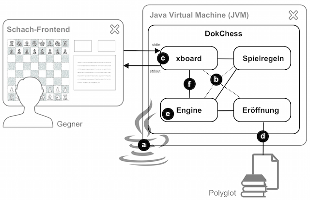

# Einstieg

## 4.1 Einstieg in die Lösungsstrategie

Die folgende Tabelle stellt die Qualitätsziele von DokChess (siehe [Abschnitt 1.2](../01-Einfuehrung-und-Ziele/01-02-Qualitaetsziele.md)) passenden Architekturansätzen gegenüber, und erleichtert so einen Einstieg in die Lösung.

| Qualitätsziel | Dem zuträgliche Ansätze in der Architektur |
| --- | --- |
| Zugängliches Beispiel (Analysierbarkeit) | - Architekturüberblick gegliedert nach arc42   - Explizites, objektorientiertes Domänenmodell   - Modul-, Klassen- und Methodennamen in Deutsch, um englische Schachbegriffe zu vermeiden   - Ausführliche Dokumentation der öffentlichen Schnittstellen in javadoc |
| Einladende Experimentierplattform (Änderbarkeit) | - verbreitete Programmiersprache Java, → **(a)**   - Schnittstellen für Kernabstraktionen (z.B. Stellungsbewertung, Spielregeln)   - Unveränderliche Objekte (Stellung, Zug, …) erleichtern Implementierung vieler Algorithmen   - „Zusammenstecken“ der Bestandteile mit Dependency Injection führt zu Austauschbarkeit, → **(b)**   - Hohe Testabdeckung als Sicherheitsnetz |
| Bestehende Frontends nutzen (Interoperabilität) | - Verwendung des verbreiteten Kommunikationsprotokolls xboard, → **(c)**   - Einsatz des portablen Java, → **(a)** |
| Attraktive Spielstärke (Attraktivität) | - Integration von Eröffnungsbibliotheken → **(d)**   - Implementierung des Minimax-Algorithmus und einer geeigneter Stellungsbewertung, → **(e)**   - Integrationstests mit Schachaufgaben für taktische Motive und Mattsituationen |
| Schnelles Antworten auf Züge (Effizienz) | - Reactive Extensions für nebenläufige Berechnung mit neu gefundenen besseren Zügen als Events → **(f)**   - Optimierung des Minimax durch Alpha-Beta-Suche, → **(e)**   - Effiziente Implementierung des Domänenmodells   - Integrationstests mit Zeitvorgaben |

Kleine Buchstaben in Klammern → **(x)** verorten einzelne Ansätze aus der Tabelle im folgenden schematischen Bild.
Der restliche Abschnitt 4 führt in wesentliche Architekturaspekte ein und verweist auf weitere Informationen.

*Bild: Informelles Überblicksbild für DokChess*
