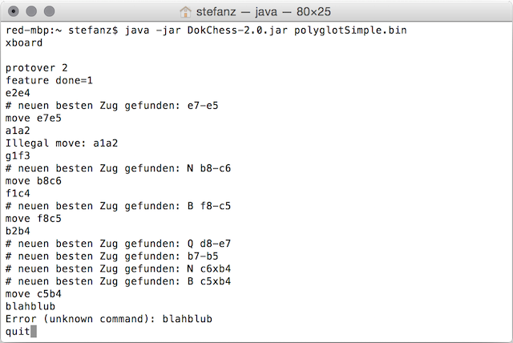

# Anbindung

## 4.4 Die Anbindung

DokChess besitzt keine grafische Benutzeroberfläche; die Kommunikation erfolgt stattdessen über die Standardein­- und -­ausgabe.
Als Kommunikationsprotokoll kommt das textbasierte XBoard-­Protokoll zum Einsatz ([→ Entscheidung 9.1 „Wie kommuniziert die Engine mit der Außenwelt?“](../09-Entscheidungen/09-01-Anbindung.md)).
DokChess lässt sich interaktiv per Kommandozeile bedienen, wenn man die XBoard­-Kommandos kennt und die Engine-Antworten zu deuten weiß ([→ Konzept 8.3 „Benutzungsoberfläche“](../08-Konzepte/08-03-Benutzungsoberflaeche.md)), siehe folgendes Bild.

Die eigentliche Engine von DokChess wird dabei über einen reaktiven Ansatz („Reactive Extensions“) angebunden ([→ 6. Laufzeitsicht, „Zugermittlung Walkthrough“](../06-Laufzeitsicht/06-01-Zugermittlung.md)).
DokChess bleibt so auch während der Zugermittlung ansprechbar, ein Benutzer kann zum Beispiel ein sofortiges Ziehen erzwingen.

Die Integration von DokChess in ein UI erfolgt unter Windows über eine Batch­-Datei (**.bat*), welche die Java Virtual Machine (JVM) unter Angabe der Klasse mit *main* Methode startet ([→ 7. Verteilungssicht](../07-Verteilungssicht/07-01-Infrastruktur-Windows.md)).
