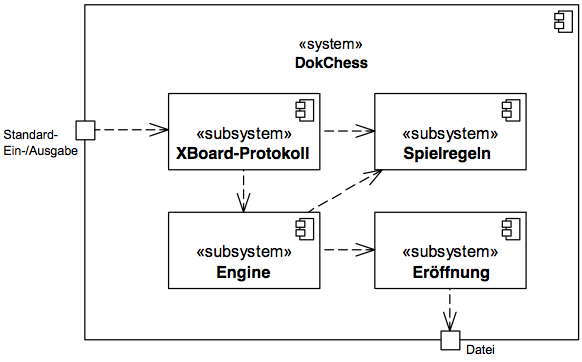

# Ebene 1

## 5.1 Ebene 1

DokChess zerfällt wie in Bild unten dargestellt in vier Subsysteme. Die gestrichelten Pfeile stellen fachliche Abhängigkeiten der Subsysteme untereinander dar (“x -> y” für “x ist abhängig von y”). Die Kästchen auf der Membran des Systems sind Interaktionspunkte mit Außenstehenden
([→ 3.2 Kontextabgrenzung](../03-Kontextabgrenzung/03-02-Technischer-Kontext.md)).

*Bild: DokChess, Bausteinsicht, Ebene 1*

---

| Subsystem | Kurzbeschreibung |
| --- | --- |
| [XBoard-Protokoll](05-02-XBoard-Protokoll.md) | Realisiert die Kommunikation mit einem Client mit Hilfe des XBoard-Protokolls. |
| [Spielregeln](05-03-Spielregeln.md) | Beinhaltet die Schachregeln und kann z.B. zu einer Stellung alle gültigen Züge ermitteln. |
| [Engine](05-04-Engine.md) | Beinhaltet die Ermittlung eines nächsten Zuges ausgehend von einer Spielsituation. |
| [Eröffnung](05-05-Eroeffnung.md) | Stellt Züge aus der Eröffnungsliteratur zu einer Spielsituation bereit. |
| *Tabelle: Überblick über Subsysteme von DokChess* | |

Abschnitt [→ 6.1 Zugermittlung Walkthrough](../06-Laufzeitsicht/06-01-Zugermittlung.md) erklärt exemplarisch das Zusammenspiel der Subsysteme zur Laufzeit.
