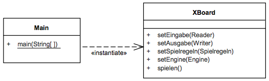

# XBoard-Protokoll

## 5.2 XBoard-Protokoll (Blackbox)

### Zweck/Verantwortlichkeit

Dieses Subsystem realisiert die Kommunikation mit einem Client (z.B. einer grafischen Oberfläche) mit Hilfe des textbasierten XBoard-Protokolls ([→ Entscheidung 9.1](../09-Entscheidungen/09-01-Anbindung.md)).
Das Subsystem liest Befehle über die Standardeingabe ein, prüft sie gegen die Spielregeln und setzt sie für die Engine um.
Antworten der Engine (insbesondere ihre Züge) werden vom Subsystem als Ereignisse entgegengenommen, gemäß Protokoll formatiert und über die Standardausgabe zurückgesendet.
Das Subsystem treibt somit das ganze Spielgeschehen. Es enthält auch die main-Methode.

### Schnittstellen

Das Subsystem stellt seine Funktionalität über die Java-Klassen *de.dokchess.xboard.XBoard* und *de.dokchess.xboard.Main* bereit:

*Bild: Klassen XBoard und Main*

---

| Methode | Kurzbeschreibung |
| --- | --- |
| setEingabe | Setzt die Protokoll-Eingabe per Dependency Injection ([→ Konzept 8.1](../08-Konzepte/08-01-Abhaengigkeiten.md)). Typischerweise ist das die Standardeingabe (stdin), automatische Tests z.B. verwenden eine andere Quelle. |
| setAusgabe | Setzt die Protokoll-Ausgabe. Typischerweise ist das die Standardausgabe (stdout), automatische Tests verwenden eine andere Senke. |
| setSpielregeln | Setzt eine Implementierung der Spielregeln, [→ 5.3 Spielregeln (Blackbox)](05-03-Spielregeln.md) |
| setEngine | Setzt eine Implementierung der Engine, [→ 5.4 Engine (Blackbox)](05-04-Engine.md) |
| spielen | Startet die eigentliche Kommunikation (Eingabe/Verarbeitung/Ausgabe) in einer Endlosschleife, bis zum Beenden-Kommando. |
| *Tabelle: Methoden der Klasse XBoard* | |

### Ablageort / Datei

Die Implementierung liegt unterhalb der Pakete *de.dokchess.xboard…*

### Offene Punkte

Die Implementierung des Protokolls ist unvollständig.
Sie reicht aber für die an DokChess gestellten Anforderungen aus.
Insbesondere werden folgende Features nicht unterstützt:

- Zeitkontrolle
- Permanent Brain (Denken, auch während die andere Seite denkt)
- Remis-Angebote und Aufgabe der anderen Seite
- Schach-Varianten (alternative Regeln, z.B. Schach960)
