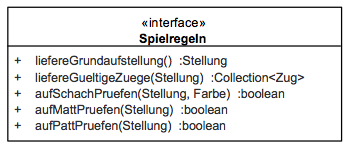

# Spielregeln

## 5.3 Spielregeln (Blackbox)

### Zweck/Verantwortlichkeit

Dieses Subsystem beinhaltet die Spielregeln für Schach gemäß Internationalem Schachverband (FIDE). Es ermittelt zu einer Stellung alle gültigen Züge und entscheidet, ob ein Schach, ein Matt oder ein Patt vorliegt.

### Schnittstelle

Das Subsystem stellt seine Funktionalität über das Java-Interface *de.dokchess.regeln.Spielregeln* bereit.

Default-Implementierung der Schnittstelle ist die Klasse

*de.dokchess.regeln.DefaultSpielregeln*.

---

| Methode | Kurzbeschreibung |
| --- | --- |
| liefereGrundaufstellung | Liefert die Grundaufstellung der Figuren zu Beginn einer Partie. Weiß ist am Zug. |
| liefereGueltigeZuege | Liefert zu einer Stellung die Menge aller gültigen Züge für den aktuellen Spieler. Der Spieler am Zug wird aus der Stellung ermittelt. Im Falle eines Matt oder Patt wird eine leere Collection zurückgeliefert, das Ergebnis ist also nie null. |
| aufSchachPruefen | Püft, ob der König der angegebenen Farbe angegriffen ist, also im Schach steht. |
| aufMattPruefen | Prüft, ob die übergebene Stellung ein Matt ist, also der aktuelle Spieler im Schach steht und kein Zug ihn aus diesem Angriff führt. Eine solche Spielsituation ist für den Spieler am Zug verloren (“Schach Matt”). |
| aufPattPruefen | Prüft, ob die übergebene Stellung ein Patt ist, also der aktuelle Spieler keinen gültigen Zug hat, aber nicht im Schach steht. Eine solche Spielsituation wird Remis gewertet. |
| *Tabelle: Methoden der Schnittstelle Spielregeln* | |

---

[Konzept 8.2 („Schach-Domänenmodell“)](../08-Konzepte/08-02-Domaenenmodell.md) beschreibt die in der Schnittstelle verwendeten Aufruf- und Rückgabeparameter (*Zug*, *Stellung*, *Farbe*).
Weitere Details entnehmen Sie der Quelltextdokumentation (javadoc).

### Ablageort / Datei

Die Implementierung liegt unterhalb der Pakete *de.dokchess.regeln…*

### Offene Punkte

Abgesehen vom Patt kann das Subsystem kein Remis erkennen. Insbesondere sind die folgenden Spielregeln bisher nicht implementiert ([→ Risiko 11.2 „Aufwand der Implementierung“](../11-Risiken/11-02-Aufwand.md)):

- 50-Züge-Regel
- Stellungswiederholung
