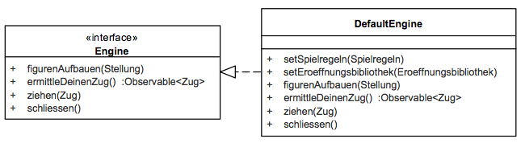

# Engine

## 5.4 Engine (Blackbox)

### Zweck/Verantwortlichkeit

Dieses Subsystem beinhaltet die Ermittlung eines nächsten Zuges ausgehend von einer Spielsituation. Diese Situation wird von außen vorgegeben. Die Engine ist zustandsbehaftet und spielt stets eine Partie zur gleichen Zeit. Die Default-Implementierung benötigt zum Arbeiten eine Implementierung der Spielregeln, die Eröffnungsbibliothek hingegen ist optional.

### Schnittstellen

Das Subsystem stellt seine Funktionalität über das Java-Interface *de.dokchess.engine.Engine* bereit. Default-Implementierung ist die Klasse *de.dokchess.engine.DefaultEngine*.

| Methode | Kurzbeschreibung |
| --- | --- |
| figurenAufbauen | Setzt den Zustand der Engine auf die angegebene Stellung. Falls aktuell eine Zugermittlung läuft, wird diese abgebrochen. |
| ermittleDeinenZug | Startet die Ermittlung eines Zuges für die aktuelle Spielsituation. Liefert Zugkandidaten asynchron über ein Observable zurück ([→ Laufzeitsicht 6.1](../06-Laufzeitsicht/06-01-Zugermittlung.md)). Die Engine führt die Züge nicht aus. |
| ziehen | Führt den angegebenen Zug aus, d.h. ändert den Zustand der Engine. Falls aktuell eine Zugermittlung läuft, wird diese abgebrochen. |
| schliessen | Schließt die Engine. Die Methode erlaubt es Ressourcen frei zu geben. Im Anschluss sind keine Zugermittlungen mehr zulässig. |
| *Tabelle: Methoden der Schnittstelle Engine* | |

---

| Methode | Kurzbeschreibung |
| --- | --- |
| setSpielregeln | Setzt eine Implementierung der Spielregeln, [→ 5.3 Spielregeln (Blackbox)](05-03-Spielregeln.md) |
| setEroeffnungsbibliothek | Setzt eine (optionale) Eröffnungsbibliothek, deren Züge gegenüber eigenen Überlegungen präferiert werden. [→ 5.5 Eröffnung (Blackbox)](05-05-Eroeffnung.md) |
| *Tabelle: Methoden der Klasse DefaultEngine (zusätzlich zu Engine)* | |

---

[Konzept 8.2 („Schach-Domänenmodell“)](../08-Konzepte/08-02-Domaenenmodell.md) beschreibt die in der Schnittstelle verwendeten Aufruf- und Rückgabeparameter (*Zug*, *Stellung*).
Details zum Engine-Subsystem finden Sie in der Whitebox-Sicht in [Abschnitt 5.6](05-06-Ebene-2-Engine.md).

### Ablageort / Datei

Die Implementierung sowie Unit-Tests liegen unterhalb der Pakete *de.dokchess.engine…*
