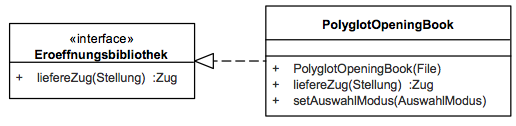

# Eröffnung

## 5.5 Eröffnung (Blackbox)

### Zweck/Verantwortlichkeit

Dieses Subsystem stellt Eröffnungsbibliotheken bereit und implementiert das Polyglot Opening Book-Format.
Bei diesem Format handelt es sich gegenwärtig um das einzig geläufige, das nicht proprietär ist.
Entsprechende Buchdateien und zugehörige Werkzeuge sind im Internet frei verfügbar.

### Schnittstellen

Das Subsystem stellt seine Funktionalität über das Java-Interface *de.dokchess.eroeffnung.Eroeffnungsbibliothek* bereit. Als Implementierung liegt die Klasse *de.dokchess.eroeffnung.polyglot.PolyglotOpeningBook* vor.

---

| Methode | Kurzbeschreibung |
| --- | --- |
| liefereZug | Liefert zur angegebenen Stellung einen aus der Bibliothek bekannten Zug, oder null |
| *Tabelle: Methoden der Schnittstelle Eroeffnungsbibliothek* | |

### PolyglotOpeningBook

Die Klasse PolyglotOpeningBook ist ein Adapter zum Polyglot Opening Book-Dateiformat.
Implementierung der Eroeffnungsbibliothek, die eine Binärdatei im entsprechenden Format einliest und einen Zug zur angegebenen Stellung zurückliefert, falls es einen gibt.

| Methode | Kurzbeschreibung |
| --- | --- |
| PolyglotOpeningBook | Konstruktor, erwartet die einzulesende Datei. |
| setAuswahlModus | Setzt den Modus zur Auswahl eines Zuges, falls es in der Bibliothek für die Stellung mehr als einen Kandidaten gibt. |

---

[Konzept 8.2 („Schach-Domänenmodell“)](../08-Konzepte/08-02-Domaenenmodell.md) beschreibt die in der Schnittstelle verwendeten Aufruf- und Rückgabeparameter (*Zug*, *Stellung*).

### Ablageort / Datei

Die Implementierung, Unit-Tests und Testdaten für das Polyglot Opening Book-Fomat liegen unterhalb der Pakete *de.dokchess.eroeffnung…*

### Offene Punkte

- Die Möglichkeiten zur Auswahl eines Zuges aus der Eröffnungsbibliothek im Fall von mehreren Kandidaten sind beschränkt (der erste, der am häufigsten gespielte, per Zufall).
- Die Implementierung kann nicht mit mehreren Bibliotheksdateien zur gleichen Zeit umgehen – sie also nicht mischen – um das Wissen zu vereinen.
