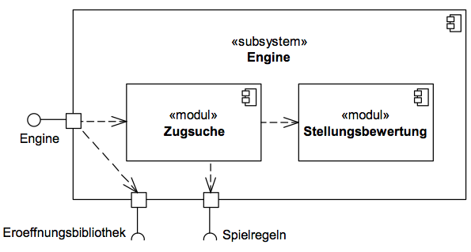

# Ebene 2: Engine

## 5.6 Ebene 2: Engine (Whitebox)

Die Engine zerfällt wie in der folgenden Abbildung dargestellt in Zugsuche und Stellungsbewertung.
Falls vorhanden wird die Ermittlung des Zuges zunächst an die Eröffnungsbibliothek delegiert.
Nur wenn diese keinen Rat weiß, kommt die Zugsuche zum Einsatz.

*Bild: Subsystem Engine, Bausteinsicht, Ebene 2*

---

| Modul | Kurzbeschreibung |
| --- | --- |
| [Zugsuche](05-07-Zugsuche.md) | Ermittelt zu einer Stellung den unter bestimmten Bedingungen optimalen Zug. |
| [Stellungsbewertung](05-08-Stellungsbewertung.md) | Bewertet eine Stellung aus Sicht eines Spielers. |
| *Tabelle: Module des Subsystems Engine* | |
