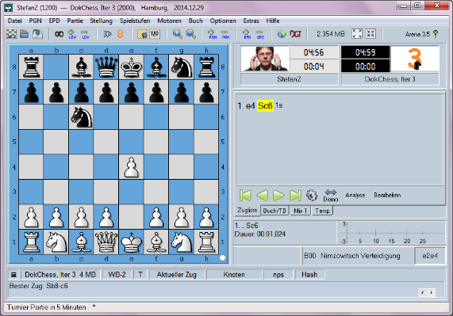

# Benutzungsoberfläche

## 8.3 Benutzungsoberfläche

DokChess verfügt selbst über keine grafische Oberfläche, sondern agiert über das XBoard-Protokoll mit der Außenwelt ([→ Entscheidung 9.1](../09-Entscheidungen/09-01-Anbindung.md)). Im Folgenden wird dies kurz skizziert.

Das Protokoll ist textbasiert, ein Starten von DokChess in einer Kommandozeile (Unix-Shell, Windows-Eingabeaufforderung, …) erlaubt eine Interaktion mit der Engine, wenn man die wichtigsten XBoard-Kommandos beherrscht (siehe Bild in [Abschnitt 4](../04-Loesungsstrategie/04-01-Einstieg.md)).
Die folgende Tabelle zeigt einen Beispieldialog, alle Kommandos werden mit einer neuen Zeile abgeschlossen). Standardmäßig spielt eine Engine schwarz, man kann das über die Protokollbefehl “white” ändern.

| Client -> DokChess | DokChess -> Client | Bemerkung |
| --- | --- | --- |
| *xboard* | | Client will XBoard-Protokoll verwenden (erforderlich, da Engines teilweise andere, teileweise sogar mehrere Protokolle verstehen) |
| | (neue Zeile) | |
| *protover 2* | | Protokollversion 2 |
| | *feature done=1* | zeilenweise Mitteilung über zusätzliche Features der Engine (hier: keine) |
| *e2e4* | | Weiß zieht Bauer e2-e4 |
| | *move b8c6* | Schwarz (DokChess) zieht Springer b8-c6 |
| *quit* | | Der Client beendet das Spiel (DokChess terminiert) |
| *Tabelle: Beispielkommunikation zwischen einem Client und DokChess (XBoard)* | | |

Das Protokoll selbst ist in [Mann+2009] detailliert beschrieben, für die Implementierung in DokChess ist das Subsystem XBoard-Protokoll zuständig ([→ Bausteinsicht 5.2](../05-Bausteinsicht/05-02-XBoard-Protokoll.md)).

Die typische Verwendung von DokChess ist das Vorschalten eines grafischen Schachfrontends wie Arena (siehe Bild unten), das die Züge der anderen Seite – inder Regel eines Menschen – über eine komfortable Oberfläche entgegennimmt und diese in Form von XBoard-Kommandos wie in der Tabelle oben an DokChess weitergibt (Spalte “Client -> DokChess”) und die Antworten (Spalte “DokChess -> Client”) grafisch umsetzt.
Die andere Seite kann auch eine andere Schach-Engine sein.

