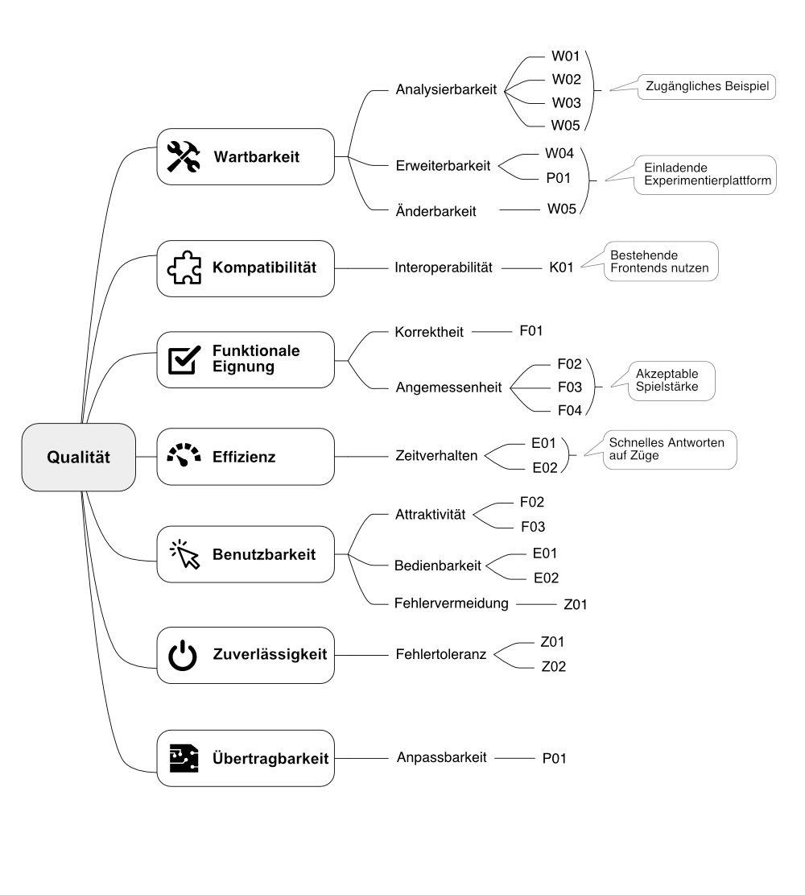

# Qualitätsbaum

## 10.1 Qualitätsbaum

Das folgende Bild gibt in Form eines sogenannten Qualitätsbaumes (englisch: Utility Tree) einen Überblick über die relevanten Qualitätsmerkmale und ordnet ihnen [Szenarien](10-02-Qualitaetsszenarien.md) als Beispiele zu.
Die [Qualitätsziele](../01-Einfuehrung-und-Ziele/01-02-Qualitaetsziele.md) sind in der Abbildung ebenfalls enthalten und verweisen jeweils auf die Szenarien, welche sie illustrieren.

